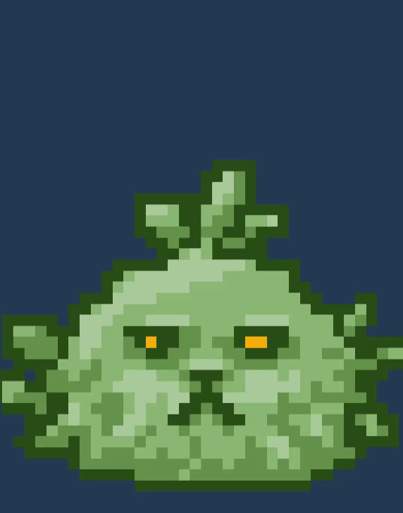
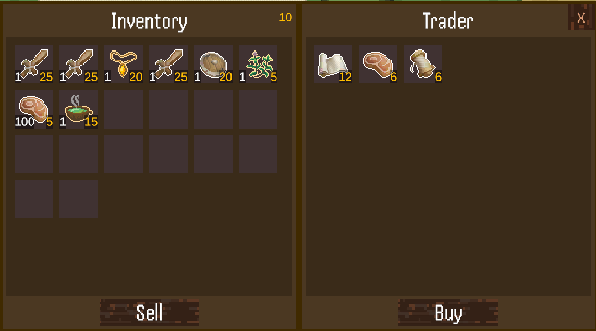
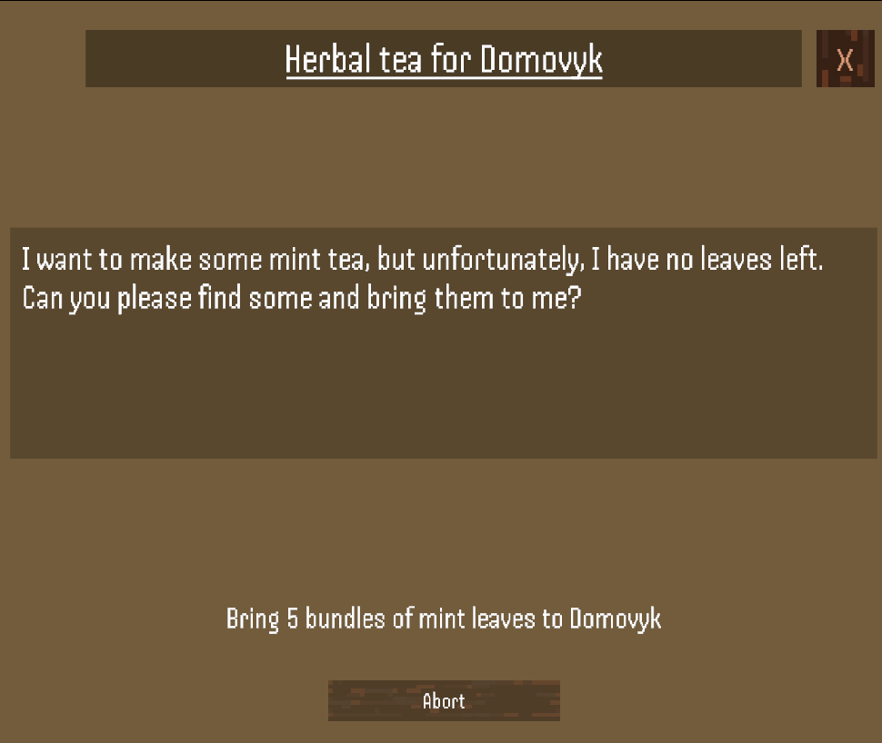

# Elder Shadows

> **Disclaimer**:   This is an unfinished university team project. We did our best at that time and learned a lot :upside_down_face:

**«Elder Shadows»** was planned as a single-player mobile 2D role-playing game based on the Ukrainian mythology.

## Features
  
Features that are there in some shape or form:

- spawn and movement of enemies
- melee, ranged, areal attacks and summon for enemies
- different reaction of creatures to each other and player depending on their karma
- flexible quest system and quest givers
- trader NPCs
- main character movement and combat
- leveling up and skills for main character
- inventory
- static and dynamic locations that are generated procedurally

## Pictures

Some attacks:

Some interaction windows:

